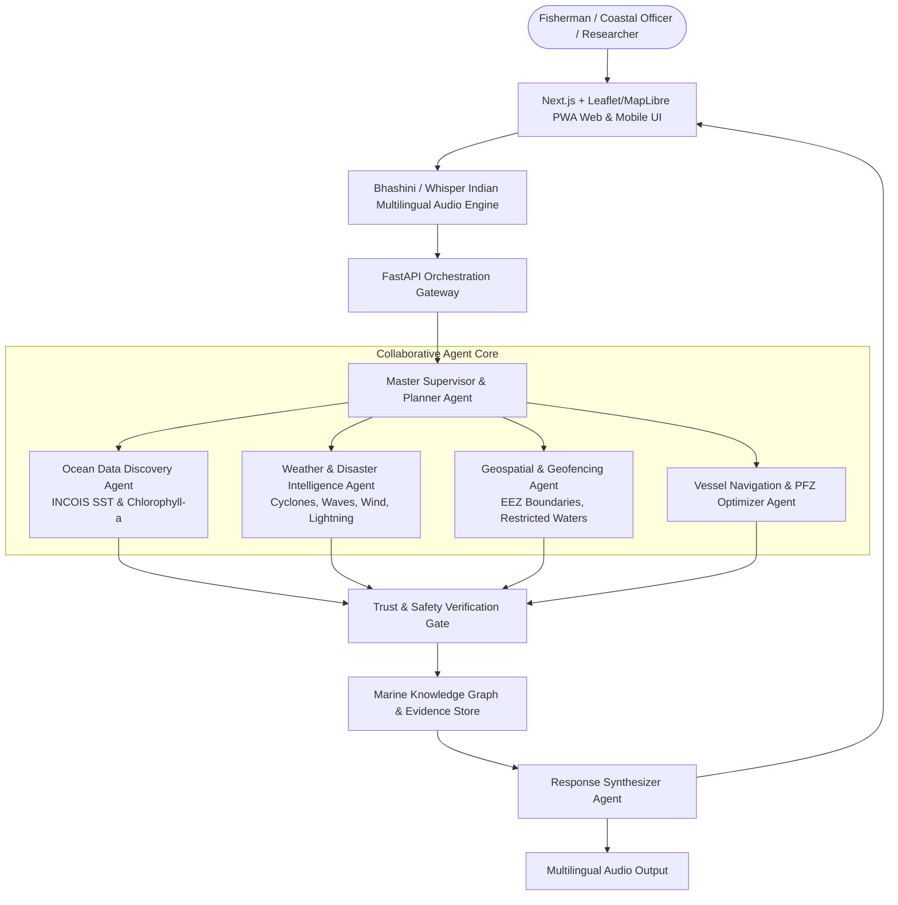

# SIH 2026: ISRO Problem Statements Analysis & Selection Guide

**Target Organization:** Indian Space Research Organisation (ISRO) / Department of Space  
**Last Updated:** September 8, 2026  
**Current Status:** All ISRO statements have extremely low competition (< 2 submissions per 500 limit).

---

## 1. Master List of Official ISRO Problem Statements

| PS ID | Title | Category | Theme | Submissions (as of Sep 8) | Fit Score (/100) |
| :--- | :--- | :--- | :--- | :---: | :---: |
| **SIH26176** | **ORCA: Marine EcOsystem Reasoning with Collaborative Agents** | Software | Disaster Management | **1 / 500** | **98** |
| **SIH26167** | **SatQuery AI: Vision-Language Assistant for Multimodal Remote Sensing** | Software | Space Technology | **1 / 500** | **94** |
| **SIH26175** | **DepthWizard: Single-View Height Estimation & 3D Flythrough** | Software | Disaster Management | **0 / 500** | **85** |
| **SIH26174** | **AI Human Activity Recognition for On-board BAS Experiments** | Software | Space Technology | **0 / 500** | **80** |
| **SIH26171** | **On-device Visual Perception for Light-weight Browser Agents** | Software | Smart Automation | **1 / 500** | **78** |
| **SIH26166** | Multi-modal, Sun angle & scale invariant image correspondence (Chandrayaan-2) | Software | Space Technology | 1 / 500 | 72 |
| **SIH26168** | AI-ML based Intelligent Dead Reckoning system for seamless navigation | Software | Smart Vehicles | 1 / 500 | 70 |
| **SIH26169** | AI-Based Virtual Camera Tracking for Mobile FSOC Terminals Alignment | Software | Smart Automation | 0 / 500 | 68 |
| **SIH26170** | AI-Driven Anomaly Detection in Component Burn-In & Screening | Software | Smart Automation | 0 / 500 | 65 |
| **SIH26173** | iTantra: Indian Multilingual TTS & STT Neural Transceiver Radio Access | Software | Smart Automation | 2 / 500 | 74 |
| **SIH26172** | Low Latency and Efficient Voice Activator for Edge Devices | Hardware | Smart Automation | 2 / 500 | N/A (Hardware) |

---

## 2. Top Pick #1: SIH26176 — ORCA (Marine EcOsystem Reasoning with Collaborative Agents)

### Overview
- **Problem Statement ID:** `SIH26176`
- **Theme:** Disaster Management
- **Category:** Software
- **Submissions:** **1 / 500** (Virtually zero competition)
- **Direct Fit With User:** **98%** (Direct 1:1 match with `@TanmayShah29`'s `trust-gated-agent-team` and `graphrag-knowledge-assistant`).

### Problem Mandate
ISRO and global oceanographic agencies produce massive volumes of Earth Observation (EO) satellite data daily: Sea Surface Temperature (SST), Chlorophyll-a concentration (Oceansat/INSAT-3D), ocean winds, tides, and severe weather tracks. Coastal communities, fishermen, and maritime operators cannot interpret raw raster NetCDF/HDF5 data or complex GIS files.

ISRO wants an **Agentic AI conversational platform** that autonomously coordinates multiple specialized AI agents, fetches real-time public satellite and weather layers, executes spatial-temporal reasoning, and generates explainable recommendations in **Indian regional languages** (Hindi, Gujarati, Tamil, Telugu, Malayalam, Bengali).

### Key Required Capabilities
1. **Multi-Agent Architecture:** Autonomous planning, tool routing, inter-agent coordination, and verification gates.
2. **Spatial-Temporal & Marine Reasoning:**
   - Identifying Potential Fishing Zones (PFZ) by correlating SST gradients with high Chlorophyll-a plumes.
   - Assessing sea-state safety for fishing vessels (wave height, cyclone cones, lightning alerts).
   - International maritime boundary geofencing (preventing fishermen from straying into Sri Lankan/Pakistani waters).
3. **Multilingual Regional Support:** Speech-to-Text and Text-to-Text in Indian coastal languages.
4. **Explainable Recommendations:** Presenting reasoning chains, confidence scores, and visual interactive maps rather than black-box text.

### Why This Problem Statement Wins at SIH
- **High Jury Emotion & Impact:** Directly impacts the lives and safety of 4+ million Indian fishermen and national maritime security.
- **Agentic AI Is the Hottest SIH 2026 Trend:** Most college teams build generic single-prompt LLM wrappers. A genuine multi-agent team with trust gating, specialized tools, and knowledge graphs blows student competition out of the water.
- **Low Dataset Barrier:** Real datasets are freely accessible via INCOIS (Indian National Centre for Ocean Information Services), ISRO Bhuvan/MOSDAC, and Copernicus Marine Service.
- **Fast Prototype Delivery:** Tanmay already has modular agent frameworks (`trust-gated-agent-team`) that can be adapted to oceanographic agents in under 48 hours.

---

## 3. Top Pick #2: SIH26167 — SatQuery AI (Interactive Vision-Language Assistant for Multimodal Remote Sensing)

### Overview
- **Problem Statement ID:** `SIH26167`
- **Theme:** Space Technology
- **Category:** Software
- **Submissions:** **1 / 500**
- **Direct Fit With User:** **94%** (Direct match with `@TanmayShah29`'s `multimodal-agentic-rag`).

### Problem Mandate
Develop an agentic vision-language assistant for analyzing single, bi-temporal, and paired cross-modal remote sensing images using natural language queries.
- **Cross-Modal Co-Registration:** Joint reasoning over optical (Sentinel-2, Cartosat) and SAR (Sentinel-1, RISAT) imagery.
- **Bi-temporal Change Detection:** Answering queries about flood damage, urban growth, or deforestation between two timestamps (`t1` and `t2`).
- **Benchmarking:** Evaluated on BigEarthNet.txt, VRSBench, RSVQA, and CDVQA.
- **Agentic Controller:** Selects specialist models/tools (VQA model, grounding model, change detector, fusion pipeline) based on user query.

### Why This Wins
- Highly technical and prestigious for ISRO Space Applications Centre (SAC) judges.
- Emphasizes true computer vision + multimodal agent routing.
- Benchmark datasets (BigEarthNet) are publicly available on Hugging Face / ArXiv.

---

## 4. Head-to-Head Comparison: ORCA (`SIH26176`) vs SatQuery AI (`SIH26167`)

| Dimension | SIH26176 (ORCA - Marine Multi-Agent) | SIH26167 (SatQuery AI - Remote Sensing VLM) | Winner |
| :--- | :--- | :--- | :--- |
| **Competition Density** | 1 submission | 1 submission | **Tie** (Near zero) |
| **Jury Demo Factor** | High visual appeal: Voice query in Gujarati/Hindi -> Marine map -> PFZ polygon + Cyclone alert + Vessel safe route | High technical appeal: Optical/SAR pair upload -> Bounding box grounding + Change map | **ORCA** (More immediate social/human impact) |
| **Alignment with GitHub Repos** | `trust-gated-agent-team` + `graphrag-knowledge-assistant` + Next.js frontend | `multimodal-agentic-rag` + PyTorch VLM fine-tuning | **ORCA** (Broader team involvement possible) |
| **Time to Working MVP (by Sep 12)** | Fast: Combine agent orchestration with INCOIS/Open-Meteo marine APIs | Medium: Requires downloading heavy satellite tiles and running local VLM inferences | **ORCA** (Much lower compute risk on college laptops) |
| **Offline Evaluation Feasibility** | Can mock or pre-cache 10 regional coastal scenes and run offline cleanly | Requires local weights for optical + SAR models (VRSBench/CDVQA) | **ORCA** |

---

## 5. Architectural Blueprint for SIH26176 (ORCA)

---

## 6. Strategic Recommendation & Next Steps

1. **Primary Recommendation:** Lock **`SIH26176` (ORCA Marine Ecosystem Reasoning with Collaborative Agents)** as the team's problem statement.
2. **Key Advantage for Internal Hackathon (Sep 12 & 14):**
   - Live speech input in regional language (e.g. Gujarati or Hindi: *"Kal Veraval thi daria ma javu safe chhe?"*).
   - Multi-agent decomposition displayed in real-time execution trace (Weather Agent checks IMD waves; Ocean Agent checks SST; Geofencing Agent checks Pakistan border).
   - High-contrast geospatial map with PFZ green zones, red weather hazard polygons, and yellow boundary markers.
   - Judges at college internal round will be stunned by the level of agentic engineering and real-world national utility.
3. **Execution Milestone:** Prepare the exact 6-slide PPT using `sih-info/03-ppt-and-idea-submission-playbook.md` custom-tailored to `SIH26176`.
