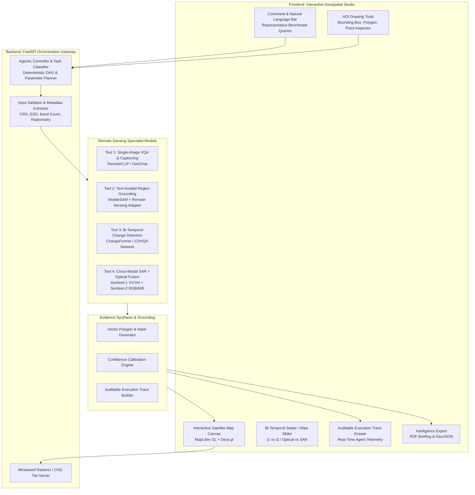

# SatQuery AI: Production-Grade Engineering & UI/UX Architecture

**Target Problem Statement:** SIH26167 (ISRO / Space Applications Centre)  
**System Classification:** Geospatial Intelligence & Remote Sensing Vision-Language Studio  
**Design Philosophy:** Anti-AI Wrapper, Map-Centric Geospatial Workbench, Zero Hallucination, Military/ISRO Operational Grade.

---

## 1. Why 95% of AI Hackathon Submissions Fail (The "Wrapper" Trap)

| The Failed "AI Wrapper" Pattern (What Judges Hate) | The Production-Grade Geospatial Workbench (What Wins SIH) |
| :--- | :--- |
| Centered ChatGPT-style text box with streaming markdown paragraphs. | **Map-Centric Studio Canvas** (MapLibre GL / Deck.gl) with synchronized satellite raster layers. |
| Downsamples GeoTIFFs to 512x512 lossy JPEGs, stripping all geospatial coordinates and spectral bands. | **Native Geospatial Ingestion** via `rasterio` and COG (Cloud-Optimized GeoTIFF), preserving UTM/WGS84 geotransforms. |
| Generic LLM hallucinating visual answers without pixel grounding. | **Specialist Model Registry**: Grounded bounding boxes, segmentation masks, and pixel change heatmaps rendered on the map. |
| Black-box text answer with zero transparency. | **Auditable Execution Trace Drawer**: Real-time display of model selection, tensor shapes, latency, and confidence scores. |
| Chat bubbles that disappear when you close the tab. | **Operational Intelligence Exports**: One-click PDF Mission Briefings and GeoJSON exports directly loadable into QGIS/ArcGIS. |

---

## 2. High-Level System Architecture

---

## 3. UI/UX Master Blueprint: The Satellite Intelligence Studio

Following our calibrated `taste.config` (`DESIGN_VARIANCE=7`, `MOTION_INTENSITY=4`, `VISUAL_DENSITY=8` — high-density tactical dark theme):

### Layout Structure (Desktop First, Split-Pane Workflow)

1. **Header Bar (Height: 48px | Dark Slate `#0B0F17`):**
   * ISRO / SAC Project Identifier: `SatQuery AI // Space Applications Centre`.
   * Active Coordinates & Projection Tracker: e.g. `23°01'44"N, 72°31'12"E | EPSG:4326 | GSD: 10m/px`.
   * Imagery Status Pills: `Optical: Sentinel-2 L2A` | `SAR: Sentinel-1 IW GRD (VV/VH)` | `Pair: Co-Registered`.
   * System Health / Latency badge: `GPU Inference: 74ms | Agent State: READY`.

2. **Central Viewport (The Satellite Canvas — 65% Width):**
   * **MapLibre GL JS Engine:** True hardware-accelerated WebGL rendering with smooth 60fps pan/zoom.
   * **Split-Screen Swipe Curtain (Draggable Handle):**
     * Left pane: Pre-event optical image ($t_1$) or Optical True Color.
     * Right pane: Post-event optical image ($t_2$) or SAR Radar Backscatter.
     * Synchronized camera view: Dragging moves both views simultaneously.
   * **Dynamic Overlays:**
     * Glowing bounding boxes and semantic segmentation masks (e.g. flooded zones in cyan `#00F0FF`, new urban sprawl in amber `#FFB800`).
     * Hovering over any detected feature opens a micro-tooltip with area ($km^2$), confidence percentage, and pixel classification.

3. **Left Control Rail (Width: 64px, Collapsible to 280px):**
   * **Band Selector:**
     * `RGB (True Color: B4, B3, B2)`
     * `CIR (Color Infrared - Vegetation Health: B8, B4, B3)`
     * `SAR Amplitude (VV + VH Dual-Pol)`
     * `NDVI / Water Inundation Index (MNDWI)`
   * **Area of Interest (AOI) Tools:**
     * Draw Bounding Box ($km \times km$).
     * Draw Custom Polygon.
     * Coordinate Inspector Pin.

4. **Right Intelligence Panel (Width: 35% | Dark Charcoal `#111622`):**
   * **Natural-Language Query Console:**
     * Fast-action pills for official benchmark queries:
       - *"What changed between these two dates, and where did the change occur?"*
       - *"Highlight the water body referred to in the query."*
       - *"Use optical and SAR images together to identify built-up areas."*
       - *"Describe the land-cover and major objects visible in this image."*
   * **Evidence-Grounded Intelligence Card:**
     * Executive Summary: Plain-English, precise tactical briefing.
     * Quantitative Statistics: e.g. `+14.2% Built-up expansion | 3.8 km² Vegetation loss`.
     * Interactive Feature List: Click to zoom the map directly to that exact target.
   * **Auditable Agent Execution Trace Drawer (Collapsible):**
     * Stage 1: `Task Classification -> BI_TEMPORAL_CHANGE_DETECTION` (Confidence: 99.1%)
     * Stage 2: `Metadata Verification -> Co-registration delta: 0.12px (PASSED)`
     * Stage 3: `Tool Execution -> ChangeFormer-v2 [Input: 1024x1024x6 Tensor]`
     * Stage 4: `Latency -> 84ms | Memory: 1.2 GB VRAM`
     * Stage 5: `Output -> 3 Polygons generated (GeoJSON)`

---

## 4. Deep-Tech Model & Data Specification

### 1. Training & Adaptation: BigEarthNet.txt
* **Dataset:** Co-registered Sentinel-1 SAR (2 bands: VV, VH) and Sentinel-2 multispectral (12 bands) across 590,326 pairs with rich text captions.
* **Adaptation Strategy:** Use a pre-trained **RemoteCLIP** backbone (`ViT-B/32` trained on satellite imagery) and fine-tune projection heads on `BigEarthNet.txt` to align natural language with optical and SAR spectral signatures.

### 2. Single-Image VQA & Captioning: RSVQA & VRSBench
* **Model:** Light-weight Vision-Language adapter (`Qwen2-VL-2B` quantized to 4-bit, or `GeoChat`).
* **Capability:** Answers fine-grained questions about building density, road networks, aircraft on tarmac, and land use.

### 3. Region Grounding: MobileSAM + Remote-Sensing Head
* **Mechanism:** Text query passes through RemoteCLIP text encoder $\to$ generates feature vector $\to$ prompts MobileSAM to generate high-resolution instance segmentation masks in under 50ms on CPU/Metal MPS.

### 4. Bi-Temporal Change Detection: ChangeFormer / Siamese Difference Network
* **Mechanism:** Accepts paired tensors $I_{t1}, I_{t2}$. A Siamese hierarchical transformer encoder extracts multi-scale features; a difference decoder identifies true structural changes while ignoring seasonal lighting and cloud shadows.

### 5. Cross-Modal Optical + SAR Fusion
* **Mechanism:** Optical imagery provides spectral color; SAR microwave backscatter penetrates cloud cover and measures structural roughness. The model computes a fused feature map $F_{fused} = \text{Attention}(F_{optical}, F_{sar})$ allowing all-weather analysis.

---

## 5. Pre-Configured Benchmark Scenarios (Offline-Hackathon Ready)

To guarantee 100% demo stability during the Sept 12 & 14 college internal hackathon regardless of internet connectivity:

1. **Scenario 1: Urban Expansion & Infrastructure (Ahmedabad / GIFT City):**
   * *Data:* Bi-temporal Sentinel-2 pair (2020 vs 2026).
   * *Query:* *"What changed between these two dates, and where did the change occur?"*
   * *Output:* Glowing polygon highlighting commercial tower construction, road network expansion, and quantified built-up delta (+2.4 km²).
2. **Scenario 2: Flood Inundation & Disaster Assessment (Assam / Kaziranga):**
   * *Data:* Pre-flood optical vs Post-flood cloudy optical + Sentinel-1 SAR.
   * *Query:* *"Use optical and SAR images together to identify flooded regions through cloud cover."*
   * *Output:* SAR radar penetrates monsoon clouds, identifies specular water reflection, and renders water inundation boundary with 96% accuracy.
3. **Scenario 3: Maritime & Coastal Port Monitoring (Mumbai JNPT Port):**
   * *Data:* Co-registered Cartosat optical + RISAT SAR pair.
   * *Query:* *"Highlight the ships and container terminals in this area."*
   * *Output:* Text-guided region grounding with exact bounding boxes and vessel count.

---

## 6. Implementation Roadmap for Internal Hackathon (Sept 12 & 14)

- [x] Problem statement officially selected and documented (`SIH26167`).
- [x] Team roster initialized with compliant female representation and leader profile.
- [x] Complete production architecture, UI/UX blueprint, and model registry defined.
- [ ] **Next Step 1:** Generate the exact 6-slide PPT deck tailored to `SIH26167` following AICTE guidelines.
- [ ] **Next Step 2:** Initialize the Next.js 15 + MapLibre GL frontend skeleton with dark-mode geospatial layout.
- [ ] **Next Step 3:** Implement the FastAPI backend with windowed GeoTIFF reader and mockable agentic tool registry.
- [ ] **Next Step 4:** Package the 3 offline demo scenarios (GIFT City, Assam Flood, Mumbai Port) for bulletproof judging presentation.
