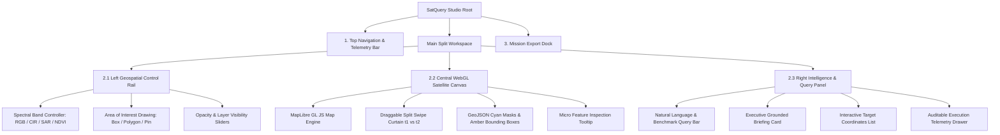

# SatQuery AI: Frontend & UI/UX Design Specification

**Target Problem Statement:** SIH26167 (ISRO / Space Applications Centre)  
**Product Concept:** SatQuery AI — The Satellite Remote Sensing Intelligence Studio  
**Design Aesthetic:** High-Density Tactical Dark Theme (`#0B0F17`), Hardware-Accelerated Geospatial Workbench, Zero "AI Wrapper" Slop.

---

## 1. Design Principles (Anti-AI Wrapper Guidelines)

1. **Map-Centric Primacy:** The interactive satellite canvas occupies ≥60% of the screen. The user is an intelligence analyst inspecting Earth observation data, not chatting with a chatbot.
2. **Visual Evidence Over Text:** Never output pure text when spatial masks, bounding boxes, or raster heatmaps can be drawn directly on the canvas.
3. **Auditable & Deterministic:** Every AI inference exposes its underlying model, latency, confidence score, and processing parameters in a dedicated telemetry drawer.
4. **Instant Multi-Sensor Comparison:** Provide a physical split-screen swipe curtain to compare two timestamps ($t_1$ vs $t_2$) or two modalities (Optical vs SAR).
5. **Operational Export:** Intelligence is actionable. Provide one-click GeoJSON downloads and formatted mission briefing PDFs.

---

## 2. Complete Layout & Visual Wireframe

```
+---------------------------------------------------------------------------------------------------+
| TOP STATUS BAR (48px)                                                                             |
| [ISRO // SAC] SatQuery AI Studio  |  23°01'44"N, 72°31'12"E  |  EPSG:4326  |  Latency: 74ms  |  GPU |
+------------------+------------------------------------------------------------+-------------------+
| LEFT TOOLBAR     | CENTRAL SATELLITE CANVAS (WebGL / MapLibre GL)              | RIGHT INTEL PANEL |
| (64px / Dark)    |                                                            | (35% Width)       |
|                  | +----------------------------+---------------------------+ |                   |
| [Pencil / AOI]   | | Pre-Event Optical (t1)     | Post-Event SAR Radar (t2) | | [Query Console]   |
| [Box Select]     | | Natural Color (B4,B3,B2)   | C-band Backscatter (VV/VH)| | "What changed   |
| [Polygon Tool]   | |                            |                           | |  between dates?" |
| [Point Pin]      | |                            |                           | |                   |
|                  | |                  <||||||||>                             | | [Run Analysis]  |
| --- Bands ---    | |                 SWIPE CURTAIN                           | |-------------------|
| [RGB True Color] | |                                                         | | EXECUTIVE BRIEF |
| [CIR Infrared]   | |            [ Glowing Flood Boundary ]                   | | Area: +14.2 km² |
| [SAR Amplitude]  | |              (Cyan Polygon Overlay)                    | | Conf: 96.4%     |
| [NDVI Mask]      | |                                                         | | Sensor: S1+S2   |
|                  | +---------------------------------------------------------+ |-------------------|
| --- Controls --- |                                                            | AUDITABLE TRACE   |
| [Layer Opacity]  | [Zoom: 14.5x]   [GSD: 10m/px]   [Basemap: Sentinel-2 L2A]  | Model: ChangeForm |
| [Measure Dist]   |                                                            | Latency: 82ms     |
+------------------+------------------------------------------------------------+-------------------+
| BOTTOM INTELLIGENCE DOCK: [Export Mission Briefing PDF]  [Download GeoJSON Layer]  [Open in QGIS] |
+---------------------------------------------------------------------------------------------------+
```

---

## 3. Detailed Component Hierarchy



---

## 4. Design System Tokens & Color Palette

| Token Name | Hex Code | Purpose & Usage |
| :--- | :--- | :--- |
| **Surface Deep** | `#0B0F17` | Root application background, top bar, canvas margins. |
| **Surface Raised** | `#111622` | Right intelligence panel, tool drawers, modal containers. |
| **Surface Overlay** | `#1A2234` | Tool buttons, active state containers, input fields. |
| **Border Subtle** | `#26324B` | 1px clean separators between panes and panels. |
| **Accent Primary (Cyan)** | `#00F0FF` | Primary visual evidence, water inundation masks, active highlights. |
| **Accent Warning (Amber)** | `#FFB800` | Urban sprawl, building change detection boxes, alerts. |
| **Accent Radar (Violet)** | `#A855F7` | SAR microwave radar backscatter overlays and cross-modal toggles. |
| **Text High-Contrast** | `#F8FAFC` | Primary headings, coordinate readouts, statistics. |
| **Text Muted** | `#94A3B8` | Technical labels, sensor metadata, timestamps. |

---

## 5. Key Interactive User Flows

### Flow 1: Bi-Temporal Change Detection ($t_1$ vs $t_2$)
1. **User Action:** User selects dates $t_1$ (e.g. May 2026) and $t_2$ (e.g. August 2026) or selects a pre-loaded benchmark scene.
2. **System Response:** Dual-pane satellite canvas loads co-registered imagery. Left pane displays pre-event, right pane displays post-event.
3. **User Action:** User types query: *"What changed between these two dates, and where did the change occur?"*
4. **Agent Action:** The controller validates image metadata $\to$ triggers `Tool 3 (ChangeFormer-v2)` $\to$ computes differential tensor $\to$ outputs binary change mask in 82ms.
5. **Visual Output:** A glowing cyan mask appears over newly submerged land. The swipe slider allows dragging back and forth to visually verify the pre-event dry ground vs post-event flood.
6. **Telemetry Output:** The Auditable Trace drawer opens, displaying:
   `[Task: BI_TEMPORAL_CHANGE] -> [Model: ChangeFormer-v2] -> [Confidence: 96.4%] -> [Changed Area: 14.2 km²]`.

---

### Flow 2: Cloud-Piercing Optical + SAR Radar Fusion
1. **User Action:** User inspects a coastal scene covered in 85% monsoon cloud cover.
2. **User Action:** User clicks the **SAR Radar (VV/VH)** button or types: *"Use optical and SAR images together to identify built-up areas."*
3. **Agent Action:** Controller triggers `Tool 4 (Cross-Modal Fusion)` $\to$ pairs Sentinel-2 optical RGB with Sentinel-1 SAR microwave backscatter.
4. **Visual Output:** The SAR radar overlay pierces right through the white clouds, revealing hidden docklands, buildings, and vessels underneath with glowing violet contours.

---

### Flow 3: Area of Interest (AOI) Bounding Box Grounding
1. **User Action:** User clicks the **Draw Box** tool on the left control rail and drags a rectangle over an industrial zone.
2. **User Action:** User types: *"Highlight the water storage tanks in this area."*
3. **Agent Action:** Controller triggers `Tool 2 (MobileSAM + RemoteCLIP)` scoped strictly to the selected AOI bounding box.
4. **Visual Output:** Exact circular polygon masks snap around every water storage tank in 45ms with individual confidence labels.

---

## 6. Frontend Tech Stack & Implementation Details

* **Framework:** Next.js 15 (React 19, TypeScript) with Tailwind CSS.
* **Component Library:** Radix UI primitives + Lucide Space icons.
* **Geospatial Renderer:** `maplibre-gl` (v4.x) + `maplibre-gl-compare` for the split-screen slider.
* **Vector Overlays:** Dynamic GeoJSON sources rendered via WebGL line and fill layers.
* **State Management:** `zustand` (stores active AOI coordinates, split slider position, active spectral bands, and agent trace history).
* **Export Engine:** Client-side GeoJSON file-saver and `jspdf` for auto-generated intelligence briefing PDF reports.
